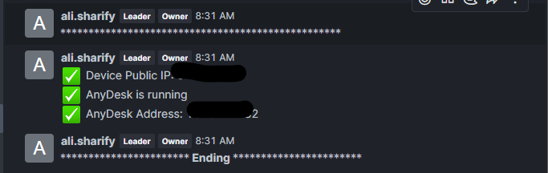

# 🖥️ AnyDesk Monitor & Notifier


### A Python script that monitors the connection status of the AnyDesk remote desktop application and sends real-time notifications to a Rocket.Chat room.


##  demo ~



## 📋 Features

- 🔐 **Rocket.Chat Authentication**: Logs in to Rocket.Chat API with provided credentials
- 📡 **AnyDesk Online Check**: Periodically checks if AnyDesk is online using command-line tools
- 🔁 **Automatic Restart**: Restarts the AnyDesk service if it goes offline
- 🧠 **AnyDesk Address Tracking**: Tracks and reports the current AnyDesk address (ID) and public IP
- 📢 **Real-Time Notifications**: Sends status updates to a predefined Rocket.Chat room
- ⏱️ **Continuous Monitoring**: Runs in an infinite loop, reporting changes in real time

## 🚀 How It Works

1. **Login to Rocket.Chat**: Uses your credentials to authenticate and obtain an auth token.
2. **Service Monitoring**: Periodically checks if AnyDesk is connected and running.
3. **Status Updates**:
   - If connected, it checks if the AnyDesk ID has changed and sends updates to Rocket.Chat with the new ID and public IP.
   - If not connected, it restarts the AnyDesk service automatically.
4. **Notifications**: All status updates, including AnyDesk status and IP, are sent to a specified Rocket.Chat room for easy tracking.

## 🧰 Requirements

- Python 3.7+ 
- `requests` library for API calls
- AnyDesk installed and running on the machine
- `systemctl` (Linux system service manager)
- Access to a Rocket.Chat server with API enabled

## 📥 Installation

Run the following command to download and install the script:

```bash
sudo sh -c "$(curl -fsSL https://raw.githubusercontent.com/alisharify7/AutoDeskID/refs/heads/main/install.sh)"
```


## 📜 Configuration
Before running the script, make sure to update your Rocket.Chat credentials and room name in the config.py file. This will allow the script to log in to Rocket.Chat and send notifications to the correct room.

## ⚙️ Running the Script
Once the script is installed, it will start running in the background and periodically monitor AnyDesk. You can also configure it to run automatically at boot using systemd.

## 🔧 Troubleshooting
AnyDesk Not Starting: If the script fails to restart AnyDesk, check the system logs for any errors in the service.
Rocket.Chat Authentication Issues: Double-check the credentials in config.py and ensure that the Rocket.Chat API is enabled.